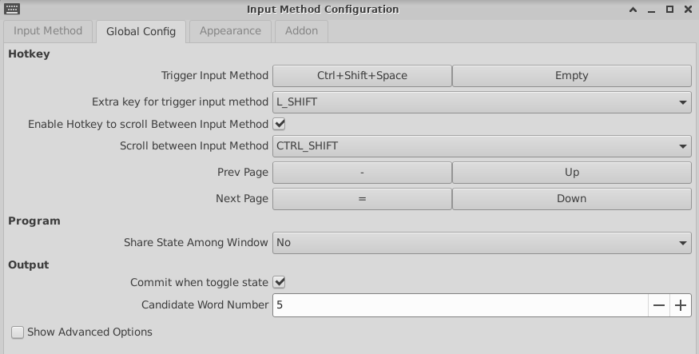

# markdown util

一个markdown小工具，可以

- 转换图片内嵌到base64
- 自动发布

在markdown中使用图片存在路径问题，无论是本地还是链接都存在迁移问题一但路径修改就无法正常显示。如果使用内置base64图片的方式可以解决这个问题，但是、但是、但是非常影响本地编辑体验，非常长的一行字符，就算放在最后也是无法接受的

由于发布与本地编写分离，可以使用转换源码不影响本地体验

```sh
mdutil c --image-to-base64=local|net|all --net-image-to-ref --recursive --tag- --output=./md_utiled .
```



## 如何验证文件是合法的image文件

- [Validate image from file in C#](https://stackoverflow.com/questions/210650/validate-image-from-file-in-c-sharp/9446045#9446045)
- [How to check if a file is a valid image file?](https://stackoverflow.com/a/902779)


